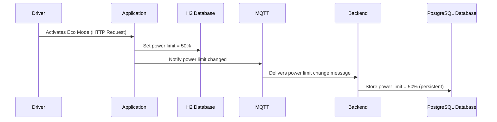

# hackathon-hustle
With this project the user can activate the ECO Mode of a vehicle.

## Architectural Overview
Here you can find a overview of the Architecture in use.

## Detailed Worklfow Description
When the user selects the Eco Mode in his Vehicle the Power Limit will be set to 50%. By de activating the Eco Mode, the Power Limit will be raised to 100% again.
These interactions will also be reflected in the backend, where the current Status of the vehicle is being monitored and stored.

## Detailed technical Description

After the Driver activates the ECO Mode, via an HTTP call to the integrated API the Application will set the Power Limit of the Vehicle to 50%. This change will be reflected in the Applications H2 In-Memory Database.
Simultaneously the application will notify the Backend about that change, via an MQTT message. The Backend reads the message and stores it in the Postgresql Database persistently, where more status informations of the vehicles are being stored.

## Technologies Used and Their Purpose

This backend service is designed as a microservice-based architecture that enables communication with a vehicle via MQTT and exposes collected data through RESTful HTTP endpoints. Each technology below has been carefully selected to ensure scalability, reliability, and maintainability.

### Core Technologies

- **Java 17**  
  The service is built on Java 17.

- **Spring Boot 3.2.0**  
  Spring Boot streamlines application setup and deployment, offering a convention-over-configuration approach. With easy to use dependency management.

- **Microservices Architecture**  
  The system follows a microservices pattern to isolate services and enhance scalability. Each component (e.g., data ingestion, API layer) can evolve or scale independently, making the system more maintainable and stable.

### Data Management

- **PostgreSQL**  
  PostgreSQL is used as the primary database for persistent data storage.

- **H2 Database**  
  H2 serves as an in-memory database for testing and local development. It was choosen as it integrates easily with Spring Boot.

### Communication and API Layer

- **MQTT**  
  MQTT (Message Queuing Telemetry Transport) is used for lightweight, reliable communication between the vehicle and the backend. It’s ideal for real-time data transfer over constrained networks.

- **OpenAPI Specification & Swagger UI**  
  The API endpoints are documented using the OpenAPI Specification. This can be viewed and tested through the integrated Swagger UI.

### Monitoring and Testing

- **Spring Boot Actuator**  
  Actuator endpoints provide insights into the application’s health, metrics, and environment.

- **Spring Boot Test**  
  Used for comprehensive integration and unit testing, ensuring service reliability and regression safety. It supports H2 for isolated test environments and simplifies dependency injection during testing.

### Security

- **Bearer Token**
The service uses a basic Bearer token-based authentication mechanism provided by Spring JWT to protect API endpoints. Due to time constraints, this was the most secure solution, which could be implemented.

